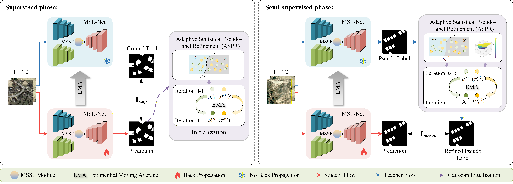
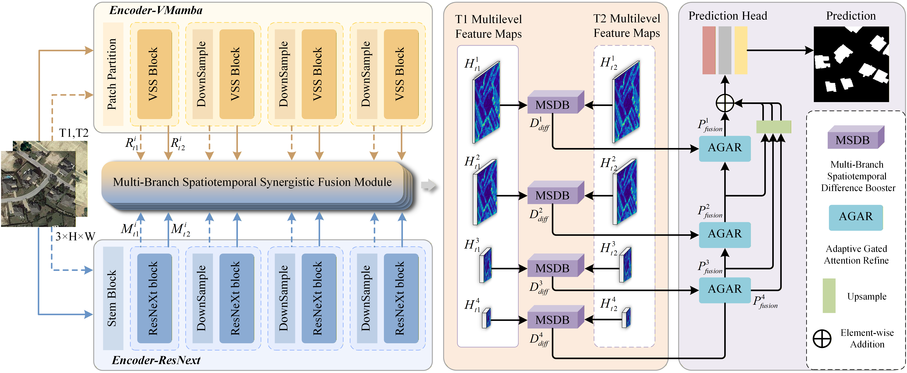

# AMS-SemiCD

**中文说明：[README_zh.md](README_zh.md)**

Official implementation of **AMS-SemiCD: A Synergistic Framework for Semi-Supervised Change Detection via an Adaptive Pseudo-Labeling Strategy and a Multi-Branch Network**.

## Overview

Semi-supervised change detection (SSCD) reduces the need for pixel-level annotations by learning from a small labeled set and a larger unlabeled set. AMS-SemiCD addresses two complementary challenges: unreliable pseudo-labels caused by class-imbalanced confidence distributions, and the difficulty of extracting both local details and long-range context from bi-temporal remote-sensing images.

The framework combines:

- **ASPR (Adaptive Statistical Pseudo-Label Refinement)**: tracks class-wise confidence statistics, derives class-adaptive dynamic thresholds, and assigns contribution-adaptive soft weights to teacher predictions.
- **MSE-Net (Multi-branch Synergistic Enhancement Network)**: integrates a CNN branch for local details and a VMamba branch for global context.
- **MSSF (Multi-branch Spatiotemporal Synergistic Fusion)**: fuses the local and global branch representations.
- **MSDB (Multi-branch Spatiotemporal Difference Booster)**: enhances the temporal difference features.
- **AGAR (Adaptive Gated Attention Refiner)**: refines and reconstructs multi-level features.

Training uses a Mean-Teacher student-teacher framework. During the initial supervised stage, labeled pairs train the Student and initialize ASPR statistics. During the semi-supervised stage, the Teacher processes weakly augmented unlabeled pairs, ASPR refines the pseudo-label confidence, and the Student is trained on strongly augmented pairs.

The paper reports experiments on **GoogleGZ-CD, WHU-CD, and LEVIR-CD**. With 20% labeled data on LEVIR-CD, the paper reports an F1 score of 91.17% and an IoU of 83.78%.

## Method figures

### Training framework



### MSE-Net architecture



## Repository structure

```text
.
├── images/
│   ├── ams.png                         # Training framework figure
│   └── mse.png                         # MSE-Net architecture figure
├── model/
│   ├── model.py                        # Formal SemiModel / SemiModel_ALL
│   ├── mssf.py                         # MSSF
│   ├── msdb.py                         # MSDB
│   ├── agar.py                         # AGAR and attention modules
│   └── vmamba/                         # VMamba backbone and selective scan
├── utils/
│   ├── data_loader_new.py              # Dataset loading and augmentation
│   └── adaptive_statistica_pseudolabel_refinement.py
├── msce_train.py                       # Training entry point
├── msce_test.py                        # Checkpoint evaluation entry point
├── msce_visual.py                      # Prediction and feature visualization
├── requirements.txt
└── model/vmamba/vmambaweight/
    └── vssm_small_0229_ckpt_epoch_222.pth
```

The released training, testing, and visualization entries use only the formal `SemiModel_ALL` model. Ablation model entries are not supported by the current code.

## Environment installation

The verified environment is Linux, Python 3.10.19, PyTorch 2.6.0 with CUDA 12.4, and one NVIDIA GPU.

```bash
conda create -n ams-semicd python=3.10.19 -y
conda activate ams-semicd

# Install the CUDA 12.4 PyTorch build first.
python -m pip install torch==2.6.0 torchvision==0.21.0 \
  --index-url https://download.pytorch.org/whl/cu124

# Install the remaining Python dependencies.
python -m pip install -r requirements.txt
```

Check the installation:

```bash
python -c "import torch, torchvision; print(torch.__version__); print(torchvision.__version__); print(torch.cuda.is_available()); print(torch.version.cuda)"
```

### Selective-scan extension

The VMamba implementation includes the source of the `selective-scan` CUDA extension. Build it after PyTorch, CUDA Toolkit, and the C++/CUDA compiler are available:

```bash
cd model/vmamba/kernels/selective_scan
python setup.py install
cd ../../../../
```

The extension is compiled for the current Python, PyTorch, CUDA Toolkit, and GPU architecture. A prebuilt `.so` copied from another machine may not be compatible. If the extension is unavailable, the code can fall back to a slower PyTorch implementation in some paths, but the CUDA extension is recommended for the reported experiments.

## Dataset download and preparation

### Download sources

The project data package is available from the provided Baidu Netdisk share:

- **Project data package:** [Baidu Netdisk: 开源数据集](https://pan.baidu.com/s/1wBIEjbyeRCQuueCT5C_DZg?pwd=65x3)
- **Extraction code:** `65x3`

Original dataset sources:

- [LEVIR-CD official project page](https://justchenhao.github.io/LEVIR/)
- [WHU Building / WHU-CD official page](https://gpcv.whu.edu.cn/data/building_dataset.html)
- [GZ-CD original project repository](https://github.com/daifeng2016/Change-Detection-Dataset-for-High-Resolution-Satellite-Imagery)

Please follow the original providers' academic-use, attribution, and image redistribution terms. The Baidu share is provided for convenience; the original dataset providers remain authoritative for dataset descriptions and usage conditions.

### Directory layout

The loader expects one dataset root for each split. Each split must contain matching files under `A`, `B`, and `label`:

```text
data/
├── LEVIR-CD-256/
│   ├── train/
│   │   ├── A/
│   │   ├── B/
│   │   └── label/
│   ├── val/
│   │   ├── A/
│   │   ├── B/
│   │   └── label/
│   └── test/
│       ├── A/
│       ├── B/
│       └── label/
├── WHU-CD-256/
│   ├── train/{A,B,label}/
│   ├── val/{A,B,label}/
│   └── test/{A,B,label}/
└── GZ-CD-256/
    ├── train/{A,B,label}/
    ├── val/{A,B,label}/
    └── test/{A,B,label}/
```

The basename of an image in `A`, its temporal pair in `B`, and its mask in `label` must match, for example:

```text
train/A/000001.png
train/B/000001.png
train/label/000001.png
```

Images are resized to 256 x 256 by default. Masks use nearest-neighbor interpolation and are binarized after tensor conversion, so labels remain binary.

### Dataset root configuration

The current training entry maps `LEVIR`, `WHU`, and `GZ` to the following paths in `msce_train.py`:

```text
/data/proj/ypc/ams-new/data/LEVIR-CD-256/
/data/proj/ypc/ams-new/data/WHU-CD-256/
/data/proj/ypc/ams-new/data/GZ-CD-256/
```

Before training on another machine, either place the prepared datasets at these paths or edit the three `train_root` / `val_root` assignments in `msce_train.py` to your local dataset root. The test and visualization entries accept `--test_root` directly.

## Pretrained weights

The default VMamba checkpoint path is:

```text
model/vmamba/vmambaweight/vssm_small_0229_ckpt_epoch_222.pth
```

The pretrained checkpoint can be downloaded from the official VMamba release:

- [vssm_small_0229_ckpt_epoch_222.pth](https://github.com/MzeroMiko/VMamba/releases/download/%23v2cls/vssm_small_0229_ckpt_epoch_222.pth)

If the file is not present, download the corresponding checkpoint and place it at that exact path, or pass another path:

```bash
--vmamba_weight_path /path/to/vssm_small_0229_ckpt_epoch_222.pth
```

The ResNeXt-50 branch uses torchvision pretrained weights by default (`res_pretrained=True`). The first model construction may download the weights to the local torchvision cache. To disable this behavior, add:

```bash
--no_res_pretrained
```

## Training

Run from the repository root. The example below trains on WHU-CD with 5% labeled images:

```bash
python msce_train.py \
  --data_name WHU \
  --train_ratio 0.05 \
  --gpu_id 0 \
  --epoch 105 \
  --batchsize 8 \
  --trainsize 256 \
  --vmamba_weight_path ./model/vmamba/vmambaweight/vssm_small_0229_ckpt_epoch_222.pth
```

Other supported datasets:

```bash
python msce_train.py --data_name LEVIR --train_ratio 0.20 --gpu_id 0
python msce_train.py --data_name GZ --train_ratio 0.20 --gpu_id 0
```

The current entry supports only `SemiModel_ALL`. ASPR is enabled by default. To disable ASPR monitoring output while keeping ASPR itself enabled, use:

```bash
python msce_train.py --data_name WHU --disable_aspr_monitor
```

Training results, checkpoints, logs, and TensorBoard files are written under the generated experiment directory below `--save_path`, for example:

```text
output/C2F-SemiCD/WHU/SemiModel_ALL_WHU_0.05_<timestamp>/
```

To resume an experiment, pass `--model_load` and set `--load_path` to the existing experiment directory.

## Testing

`msce_test.py` evaluates checkpoints found under `--save_path` and uses the formal `SemiModel_ALL` model:

```bash
python msce_test.py \
  --test_root /path/to/WHU-CD-256/test \
  --save_path ./output/C2F-SemiCD/WHU/SemiModel_ALL_WHU_0.05_<timestamp> \
  --gpu_id 0
```

The test loader expects the same `A`, `B`, and `label` layout described above. Use `--cpu` only in the visualization entry; `msce_test.py` automatically falls back to CPU when CUDA is unavailable.

## Visualization

Use `msce_visual.py` to generate predictions, confusion maps, heatmaps, and optional feature visualizations:

```bash
python msce_visual.py \
  --dataset_name WHU \
  --test_root /path/to/WHU-CD-256/test \
  --save_path ./output/C2F-SemiCD/WHU/SemiModel_ALL_WHU_0.05_<timestamp> \
  --save_dir ./test_results/WHU-SemiModel_ALL \
  --checkpoint_type auto \
  --gpu_id 0
```

The visualization entry supports `--checkpoint_type student`, `teacher`, or `auto`; `auto` follows the checkpoint metadata when available.

## Citation

If you use this code or the AMS-SemiCD method, please cite the paper:

```bibtex
@article{zhang2026amssemicd,
  title   = {AMS-SemiCD: A Synergistic Framework for Semi-Supervised Change Detection via an Adaptive Pseudo-Labeling Strategy and a Multi-Branch Network},
  author  = {Di Zhang and Peicheng Yue and Huifang Ma and Zhanjun Hao and Xin He and Yun Liu and Jiaqi Zhao},
  journal = {IEEE Journal of Selected Topics in Applied Earth Observations and Remote Sensing},
  year    = {2026}
}
```

Paper: *AMS-SemiCD: A Synergistic Framework for Semi-Supervised Change Detection via an Adaptive Pseudo-Labeling Strategy and a Multi-Branch Network* (the final accepted manuscript is included with the project materials). The project page is [RSII-NWNU/AMS-SemiCD](https://github.com/RSII-NWNU/AMS-SemiCD).

## Notes and limitations

- The repository does not redistribute the original remote-sensing datasets; obtain them from the listed sources and follow their terms.
- Only the formal `SemiModel_ALL` path is maintained in the current code.
- The default commands assume a CUDA-capable Linux environment. CPU execution is useful for smoke tests but is not intended for full training.
- Please verify the CUDA driver and CUDA Toolkit before compiling `selective-scan`.
